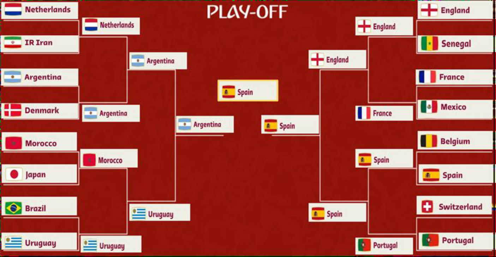

# Simulating the 2022 FIFA Men's World Cup

The FIFA Men's World Cup is the pinnacle of men's futbol. Grabbing the attention of more than half the world at a time, it enables us to shine bright lights, none more so in 2022 than that on the host nation, Qatar.

This is a collaborative effort with Alexander John and Eric Sundberg, without whom this work would not even be remotely close to where it is.

The good, the bad and the not so great at all about the 2022 FIFA World Cup:
-[Never participated in one before, but host now?](https://www.youtube.com/watch?v=gHjbay54F4U)
-[Massive, beautiful stadiums, at what cost?](https://www.youtube.com/watch?v=C-0CebFpF_s)
-[John's got good deets](https://www.youtube.com/watch?v=UMqLDhl8PXw)
-[Greatest Final of My Lifetime(as of 2023)](https://youtu.be/zhEWqfP6V_w)

